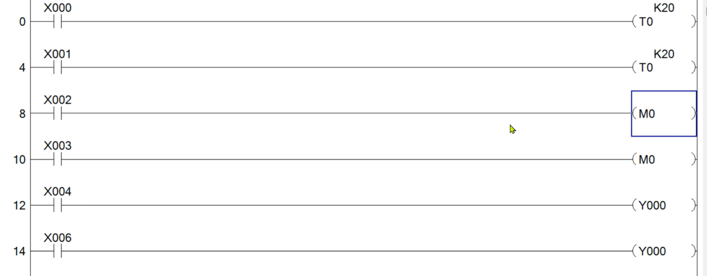
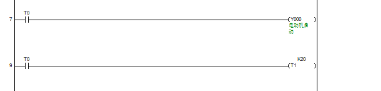
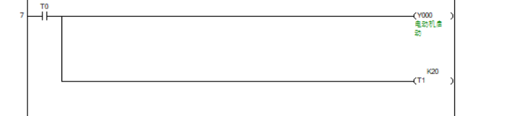
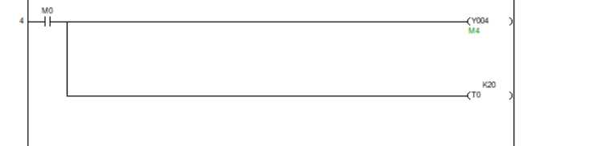
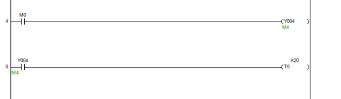

# 梯形图编程

## 编号相同的线圈一定不能重复

当你重复了线圈，会执行最后一条指令

触点是可以重复的

## 并联输出写法推荐

写法1：

写法2：

| **维度**     | **写法一（分行写）**                                     | **写法二（并联输出）**                                       |
| ------------ | -------------------------------------------------------- | ------------------------------------------------------------ |
| **逻辑结果** | `T0` 接通时，`Y000` 置 ON，同时 `T1` 开始计时。          | 同左，完全一致。                                             |
| **程序步数** | **占用步数较多**。PLC 需要重复读取 `T0` 的状态。         | **占用步数较少**。PLC 只需读取一次 `T0` 状态，然后通过分支指令驱动多个输出。 |
| **扫描周期** | 极微小地增加了扫描时间（多了一次指令解析）。             | 效率更高。                                                   |
| **可读性**   | 适合两个动作逻辑关联度不高，只是碰巧触发条件相同的情况。 | **直观**。一眼就能看出 `Y000` 的启动和 `T1` 的计时是属于同一个动作序列。 |

**推荐使用：写法二（并联输出）**

理由如下：

1. **逻辑归类**：在工业控制中，`Y000`（电动机启动）和 `T1`（计时器）通常是属于同一个控制步。把它们写在一起，能更明确地表达“**当这个条件满足时，执行这一组动作**”的逻辑意图。
2. **节省内存**：对于三菱（或兼容）PLC，写法二生成的机器码更短。在大型程序中，合理使用并联分支可以节省宝贵的程序步（Steps）。
3. **修改方便**：如果你以后想把触发条件 `T0` 改成 `M10`，写法一你要改两个地方，写法二只需要改一个地方，降低了出错率。

## 并联输出和串行级联

写法1：

写法2：

这两段代码**完全等效**，PLC 运行起来效果没有区别。

### 1.扫描周期的细微差异

PLC 是从上到下、从左到右循环扫描的：

- **图 1：** 在同一个扫描周期内，`M0` 状态一旦确定，`Y004` 和 `T0` 的状态会立即在当前程序段被更新。
- **图 2：** 虽然在同一个扫描周期内，`Y004` 线圈在上，触点在下，所以 `T0` 也会在同一周期内接通。但这种写法增加了对 `Y004` 状态的依赖。如果程序其他地方又对 `Y004` 进行了修改（比如出现了“双线圈”情况，虽然不建议这么做），图 2 的稳定性会受影响。

------

### 2. 编程习惯与优劣

- **图 1 的优点（推荐）：**
  - **直观：** 明确表示 `Y004` 和 `T0` 是由同一个条件 `M0` 触发的从属关系。
  - **简洁：** 减少了不必要的触点使用，节省了程序步数（Steps）。
  - **安全：** 避免了因为 `Y004` 在程序其他位置被意外复位而导致 `T0` 无法工作的风险。
- **图 2 的特点：**
  - 这种写法通常用于“确认输出成功后再执行下一步”的逻辑。但在这种简单的输出指令中，由于 `Y004` 是软元件映像表操作，并没有真正的物理反馈，所以这种“自确认”逻辑在逻辑上显得冗余。

## 双定时器实现循环

**计时器 T0（控制“灭”的时间）：** 当按下启动按钮后，T0 开始计时。等它时间到了，它的常开触点闭合，去触发 **T1**。

**计时器 T1（控制“亮”的时间）：** T1 开始计时。等它时间到了，它的**常闭触点**会断开，从而切断 **T0** 的电源。

**循环发生：** T0 掉电后，其常开触点也随之断开，导致 T1 也跟着掉电复位。T1 掉电后，它的常闭触点重新闭合，再次给 T0 通电。